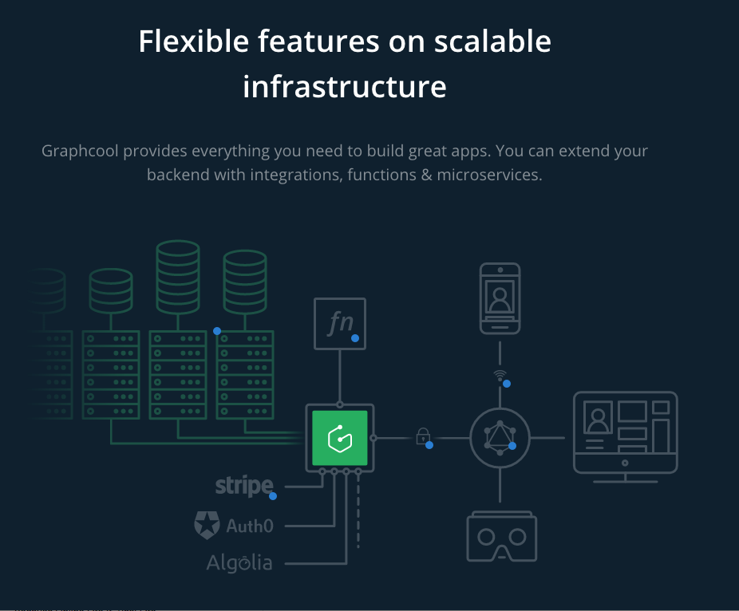
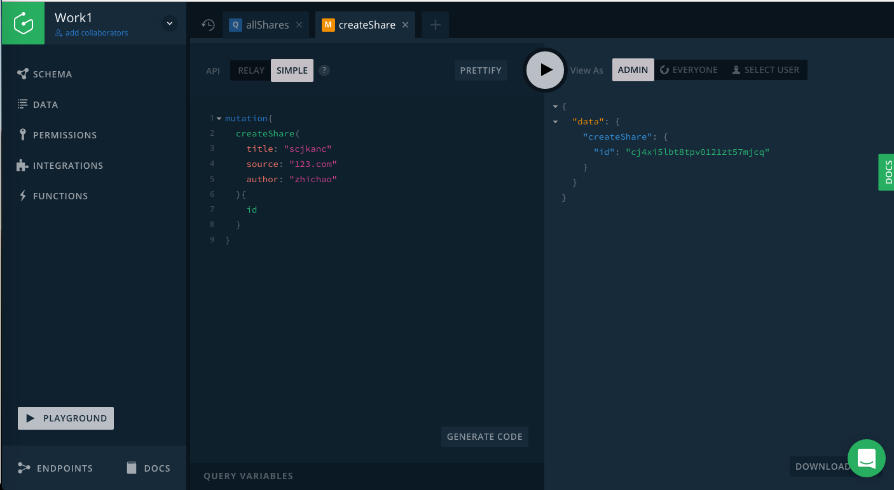
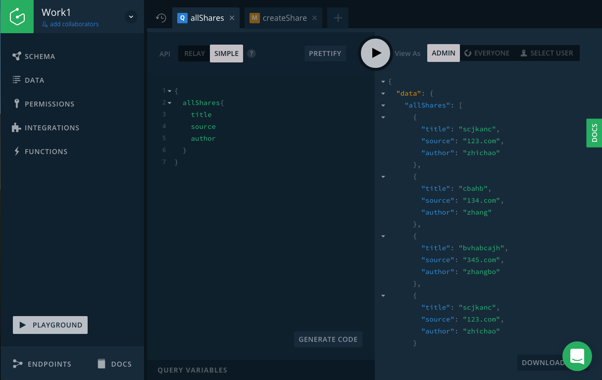
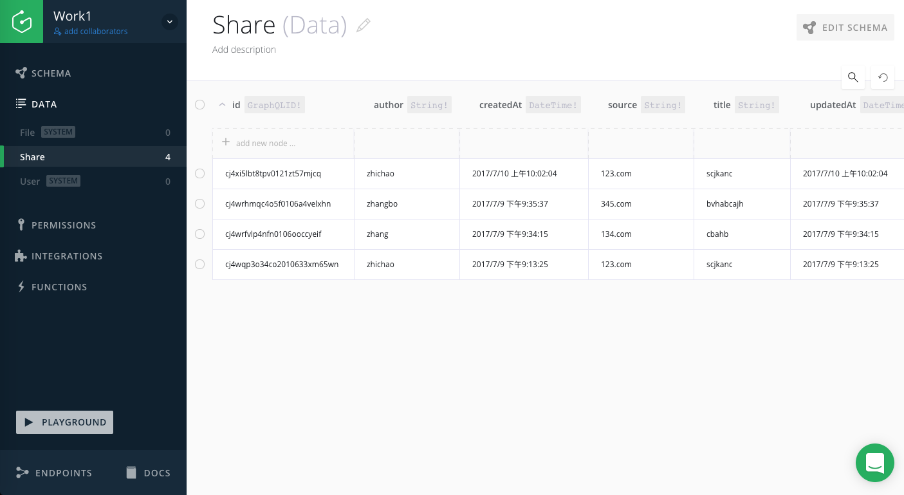

# Vue & ApolloClient & Graphql

## 说明

1. **Graphql**构建数据驱动产品（数据接口),一系列规则
2. [Graphcool](https://www.graph.cool/)给开发者提供了一个已经开发生产好的GraphQl后端，更快的构建app应用。

3. [Graphcool Console](https://console.graph.cool) 使用一个UI可以很直观方便的创建GraphQl后端。
4. **ApolloClient** 将应用和GraphQL API连接起来，这里使用的是Simple API。

## 介绍

使用vue+ApolloClient快速构建的一个列表。

### Graphcool Console
##  查询类型

### 一条提交数据

### 记录的所有提交数据
